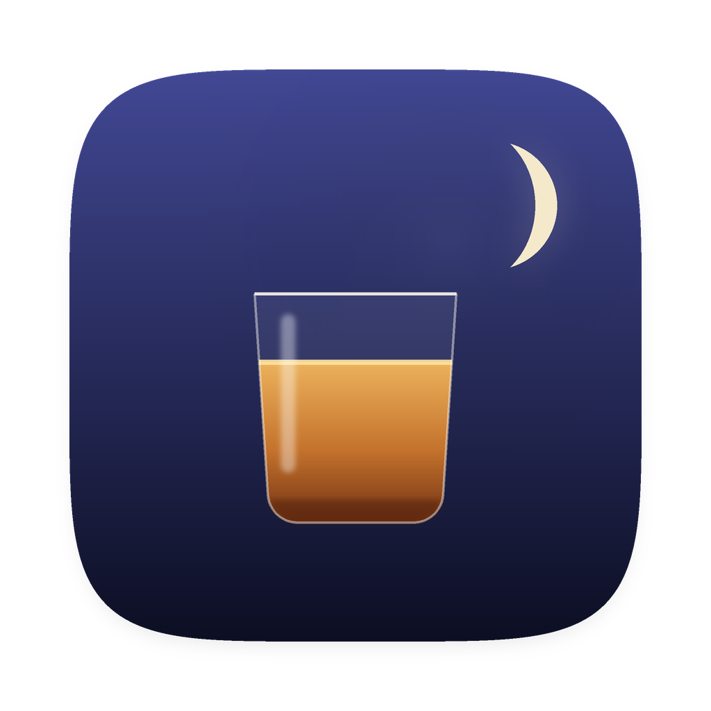
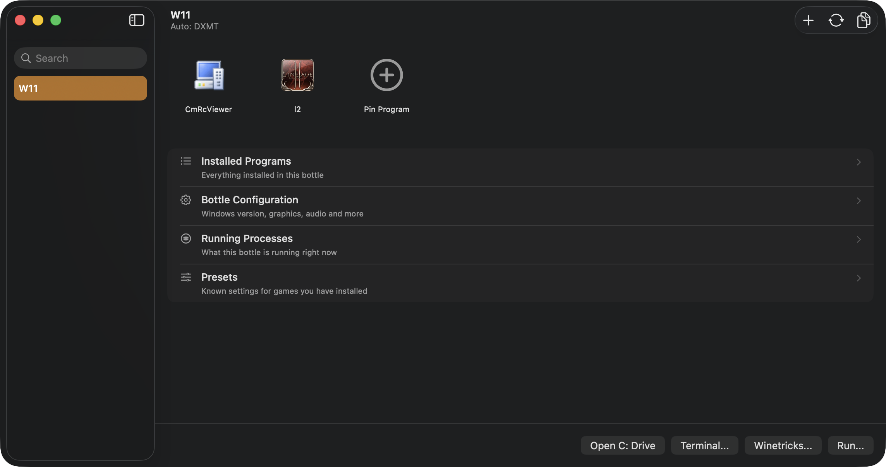
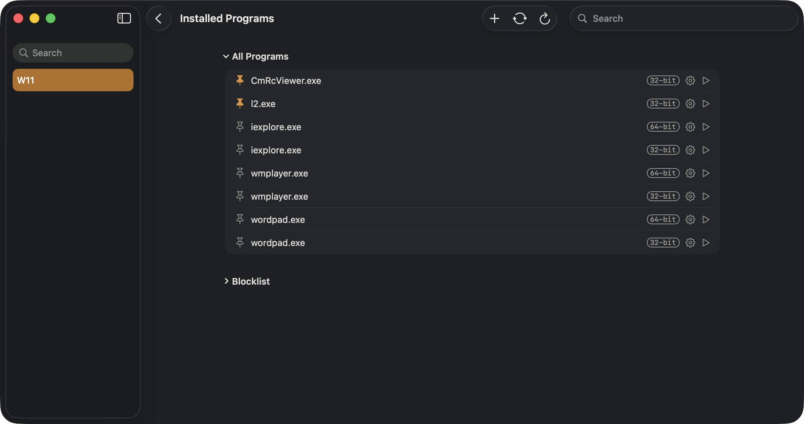
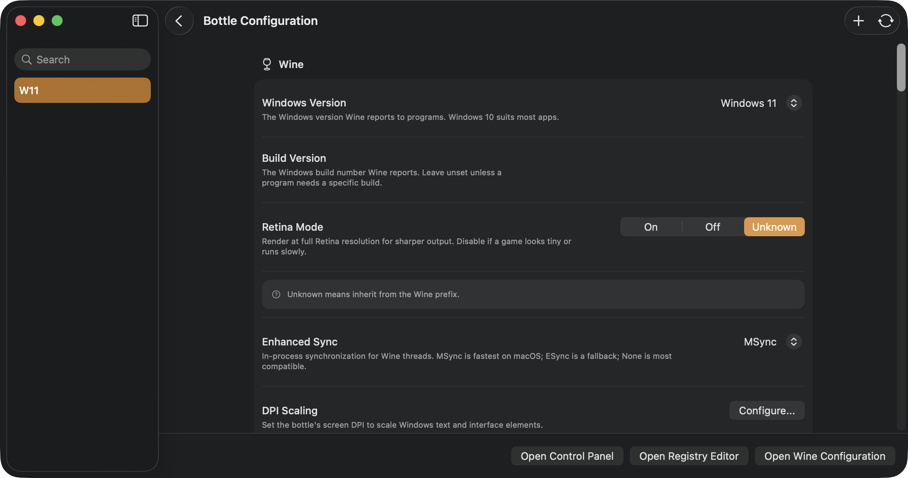
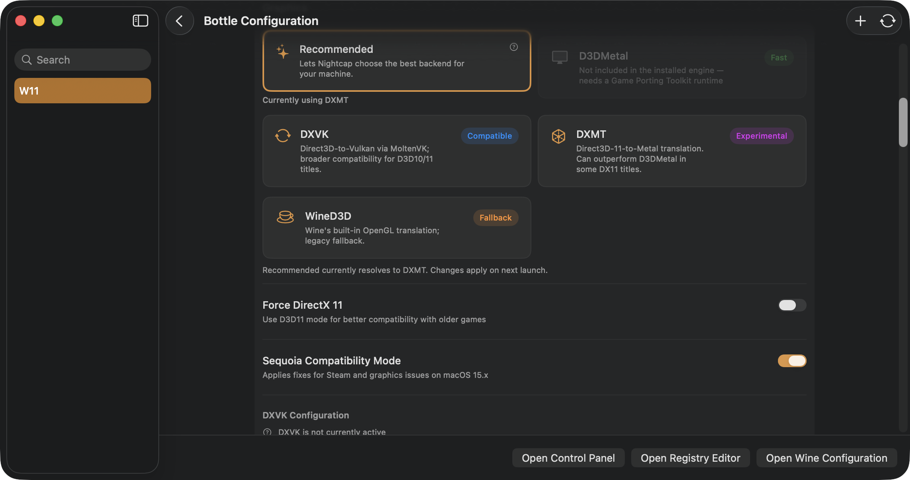
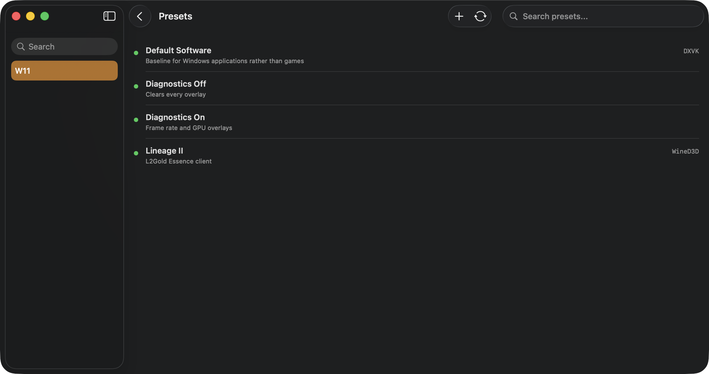
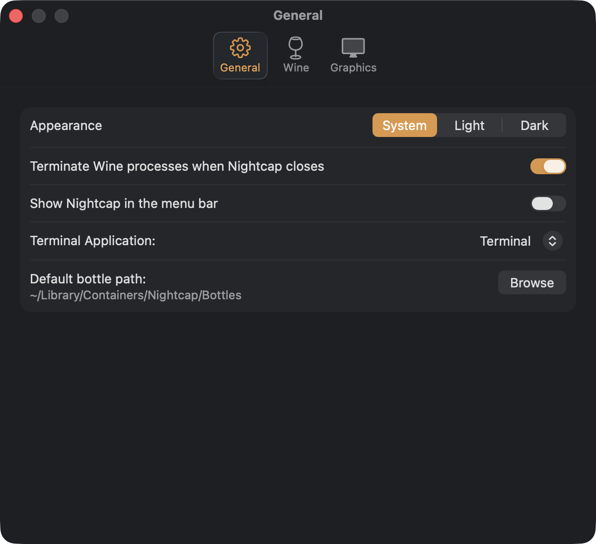

<div align="center">



# Nightcap 🥃

*Wine but a bit stronger*

Run Windows games and applications on Apple Silicon.

</div>

---

Nightcap is a native SwiftUI wrapper around Wine. Create a bottle, install a Windows program, run it.

**Forked from [frankea/Whisky](https://github.com/frankea/Whisky)**, the community continuation of
[Whisky](https://github.com/Whisky-App/Whisky) by [Isaac Marovitz](https://github.com/IsaacMarovitz),
which was archived in April 2025. Not affiliated with either project.

Changes made in this fork, 2026: rebranded to Nightcap; Sparkle auto-updates removed; all analytics and
data collection removed; presets in place of the game configuration browser; the Wine runtime self-hosted
on this repository's releases; Swift 6 across every target; bottle configuration flattened so nothing is
hidden; Windows 11 the default for new bottles; the interface rebuilt on one set of components so a
status, a row or a card reads the same wherever it appears.



## Requirements

Apple Silicon · macOS 15 or later · Windows 11 bottles

## Programs

Everything the bottle has, with its architecture, a settings sheet of its own, and a pin for the ones you
actually launch. Pinned programs sit at the top of the bottle.



## Configuration

One page, nothing folded away. Every setting says what it does in prose rather than in a tooltip you have
to hover to find, and anything the bottle has to be asked for — the Windows version, Retina mode — reports
what it actually came back with.



## Graphics

Pick a backend per bottle. Only one of them accepts Direct3D 9.

| Backend | Translates | Use for |
|---|---|---|
| **DXMT** | D3D11 → Metal | Most modern games |
| **D3DMetal** | D3D12 → Metal | DX12 titles. Needs your own [GPTK](https://developer.apple.com/games/game-porting-toolkit/) import |
| **DXVK** | D3D10/11 → Vulkan | Compatibility fallback; Chromium and Electron UIs |
| **WineD3D** | D3D9 → OpenGL | Older games. The only D3D9 path |

A backend the installed engine cannot provide is shown greyed with the reason, rather than being offered
and then silently falling back at launch.



## Presets

Named configurations you apply to a bottle. Applying one restarts the bottle so it takes effect
immediately. **Diagnostics On** adds a live frame-rate readout under Running Processes.



## Settings

Appearance follows the system by default, and can be pinned to light or dark for Nightcap alone without
touching the rest of the Mac.



## Building

```sh
brew install swiftlint swiftformat
xcodebuild -project Nightcap.xcodeproj -scheme Nightcap -configuration Release build
```

SwiftLint runs as a build phase. CI pins SwiftFormat to **0.58.7** — newer releases format differently and
CI will reject the result.

## Notes

- No auto-updates. Sparkle is gone; upstream is tracked with git.
- The Wine runtime downloads on first launch to
  `~/Library/Application Support/com.gasanache.Nightcap/Libraries`, separate from the app bundle.
- Two engines exist and they are a trade, not an upgrade: the stock engine is newer Wine, the
  GPTK-capable one is older Wine that can execute D3DMetal.

## Credits

Nightcap exists because of other people's work.

**The app** is [Whisky](https://github.com/Whisky-App/Whisky) by Isaac Marovitz and its contributors,
continued by [frankea](https://github.com/frankea) and the contributors to that fork — which is the code
this repository was forked from. Almost everything here is theirs, under their copyright.

**The runtime** is [Wine](https://www.winehq.org), packaged for macOS by
[Gcenx](https://github.com/Gcenx), descending from CodeWeavers' CrossOver.

**Graphics translation** is [DXMT](https://github.com/3Shain/dxmt) by 3Shain,
[DXVK-macOS](https://github.com/Gcenx/DXVK-macOS) by Gcenx and doitsujin,
[MoltenVK](https://github.com/KhronosGroup/MoltenVK) by KhronosGroup, and D3DMetal by Apple.

**Also** [msync](https://github.com/marzent/wine-msync) by marzent, and ohaiibuzzle and Nat Brown for
their contributions upstream.

## License

**GPL-3.0**, inherited from Whisky. This is a derivative work, so the licence carries over and cannot be
changed — the copyright belongs to the upstream authors. See [LICENSE](LICENSE); the source for anything
distributed from here is this repository.
